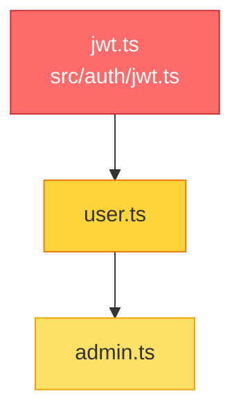

# Blast Radius (CodeLookup-inspired pre-implementation safety check)

## Purpose

Before an implementer starts editing, warn what the target files' callers and transitive dependents are so spec reviews catch scope creep early (not after diff exists). Outputs a Mermaid diagram, risk level, and machine-readable json that slots directly into task-N.md.

From CodeLookup's pattern:
- Static import graph (reuses `.opencode/knowledge/graph.json` when present)
- Git diff target when not explicit
- BFS reverse dependency trace (depth configurable, default 2)
- Mermaid "blast radius" output
- Agent action protocol: resolve dependents together, prevent broken commits

## When to run

- Automatically before each implementer dispatch (orchestrating skill runs this).
- Manually when user asks "what will break if I change X?" or "blast radius of Y?".
- In spec-reviewer / code-reviewer when verify caller handling.

## Commands

```bash
# Default: diff base...HEAD (or staged + untracked if no feature branch)
./scripts/nexus-blast.sh                            # shell wrapper (rg heuristics)
node ./scripts/nexus-blast.js                       # full version (graph + Mermaid + JSON)

# Explicit file list:
node ./scripts/nexus-blast.js --files src/auth/jwt.ts,src/middleware/auth.ts --mermaid

# For a specific task with artifact persistence:
node ./scripts/nexus-blast.js --task 3 --files src/auth/jwt.ts --mermaid
# → writes .opencode/knowledge/blast/task-3.md + .json

# Deeper search:
node ./scripts/nexus-blast.js --depth 3 --files src/utils.ts

# Who depends on this file? (explain mode – no diff, single file focus)
node ./scripts/nexus-blast.js --explain src/auth/jwt.ts

# JSON output only (for scripting):
node ./scripts/nexus-blast.js --json --files src/utils.ts

# Override base branch for diff:
node ./scripts/nexus-blast.js --base main --mermaid

# Shell fallback when node unavailable:
./scripts/nexus-blast.sh --task 2
```

## Output formats

### Human markdown (default)

Written to stdout and (when --task given) `.opencode/knowledge/blast/task-N.md`:

```markdown
# Blast Radius – risk: MEDIUM (score 8)

Changed files (2):
- src/auth/jwt.ts
- src/middleware/auth.ts

2 downstream file(s) may be affected:
| File | Depth | Via |
|------|-------|-----|
| src/api/routes/user.ts | 1 | src/auth/jwt.ts → src/api/routes/user.ts |
| src/api/routes/admin.ts | 2 | src/auth/jwt.ts → src/api/routes/user.ts → src/api/routes/admin.ts |

## Mermaid (blast radius diagram)

[mermaid diagram – see below]

## Implementer guidance
- MEDIUM risk: some callers – verify callers still behave, add tests for caller paths.
- Review diff with: git diff <base>...feature/task-N-<slug>
```

### Mermaid (via --mermaid)



### JSON (via --json or after markdown separated by ---JSON--- marker)

```json
{
  "files": ["src/auth/jwt.ts"],
  "level": "MEDIUM",
  "score": 8,
  "impacts": [{"file":"src/api/routes/user.ts","depth":1,"via":["src/auth/jwt.ts","..."],"direct":true}],
  "edges": [{"from":"src/auth/jwt.ts","to":"src/api/routes/user.ts","depth":1}]
}
```

### Artifacts (when --task N)

- `.opencode/knowledge/blast/task-N.md` – full markdown + mermaid
- `.opencode/knowledge/blast/task-N.json` – pure JSON (machine-readable)

## Risk scoring

- Direct dependent (depth 1): +3 to score
- Transitive depth 2: +2
- Transitive depth 3+: +1
- LOW: score <5 and <3 impacted files
- MEDIUM: score 5-14 or 3-9 impacted files
- HIGH: score ≥15 or ≥10 impacted files, or signature change detected near many importers

Risk drives reviewer behavior:
- LOW → proceed, but run task tests
- MEDIUM → spec-reviewer must verify related callers section of task file, add tests for caller paths
- HIGH → flag to orchestrator to consider splitting task, expanding scope in writing, or discussing with user before implementer starts

## How graph improves blast (but not required)

- If `.opencode/knowledge/graph.json` present from `nexus-graph.sh`, blast uses exact reverse index from import edges (precise, not heuristic rg).
- If missing, blast script auto-builds graph, or falls back to shell `rg -l <basename>` caller heuristics (low fidelity, but still useful for small repos).
- Shell fallback is inside `nexus-blast.sh` – uses rg to find files referencing target basename. Install rg for best shell-fallback accuracy.

## Integration points

- writing-plans: task-N.md must include "Related callers (blast)" section – populated either from real blast run (if graph present during planning) or placeholder "no graph.json yet, run nexus-graph.sh / nexus-blast.js --task N".
- orchestrating:
  - Step 2 of per-task loop runs `node scripts/nexus-blast.js --files <csv> --task N --mermaid` before dispatch
  - Pastes blast markdown into task file or attaches as context
  - If blast HIGH, flags to spec-reviewer to watch scope creep
  - If new callers discovered after graph re-run, updates task-N.md Knowledge section
- implementer:
  - Required reading includes blast report
  - Must ensure callers listed still work (via tests or manual evidence)
  - If signature change, update callers listed in blast or document required follow-up with task link
- spec-reviewer and code-reviewer:
  - Required reading includes blast report
  - Verify callers handling (spec-reviewer: scope fidelity, code-reviewer: regression)
- outcome-memory: blast risk and callers recorded in LESSONS entry

## Troubleshooting

- Empty blast (no dependents)? Likely:
  - Target file is leaf module (no one imports it) – LOW risk, safe
  - Graph missing bare import edge due to barrel import or alias – re-run with shell fallback: `./scripts/nexus-blast.sh --files X`
  - Use explain mode to double-check: `node scripts/nexus-blast.js --explain src/foo.ts`
- Blast too noisy (100+ dependents)? File is god node (utils, constants, logger). For god nodes, orchestrator must recommend task split or note that all callers need lint-only check, not full test.
- graph.json stale? Run `./scripts/nexus-graph.sh` to refresh before blast.

## Hard rules

- Never edit production code – only `.opencode/knowledge/blast/*`
- Safe to re-run – overwrites existing blast report for same task number
- When graph missing, degrade gracefully with rg fallback, but log warning in output
- Blast output includes "How graph was built" note so reviewers know confidence (EXTRACTED vs INFERRED from shell heuristics)
