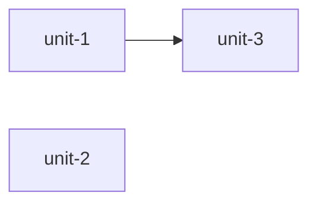

# Writing Plans (V5 execution units)

**Always** create a plan after brainstorming. There is no "small enough to skip planning" path.

Create or update `.opencode/plans/PLAN.md` — a self-contained, verification-gated plan. The orchestrator executes cohesive execution units **one by one** through the fixed pipeline (pre-impact → implementer → VERIFYING → deterministic `nexus verify` → reviewer). `task-*` identifiers remain a compatibility alias.

This skill borrows the three guarantees from shadcn/improve:
- **Self-contained.** All context inlined — exact file paths, current-state excerpts, conventions with an exemplar, git commit stamped.
- **Verification gates.** Each implementation step ends with a targeted command + expected output. The full unit still has its own machine-checkable verification gates.
- **Hard boundaries.** Explicit scope, explicit out-of-scope, explicit STOP conditions.

## Step 0 — Recon (always before planning)

Repository-level recon is cached. Start with:

```bash
nexus project-profile --json
```

It returns, from cache when the source files are unchanged: ecosystem, package
manager, exact build/test/lint/typecheck commands, CI config paths, AGENTS /
CLAUDE / CONTRIBUTING locations, intent/ADR locations, memory locations, base
branch, and root config metadata. The cache lives at
`.opencode/cache/project-profile.json`, is keyed by the **content** of those
source files (an unrelated code commit does not invalidate it), and is
**advisory only** — it can never authorize a gate or a transition.

Then do the task-specific reading the cache deliberately does not hold:

1. Read the target implementation and its tests, at the exact file:line you will cite as evidence.
2. Read the relevant callers/paths the change flows through.
3. Read the applicable design/ADR document when the task touches a decided trade-off.
4. Read one task-specific implementation exemplar to match conventions.
5. Record `git rev-parse --short HEAD` → every plan stamps the plan/base commit it was written against. Executors must run a drift check before touching code.
6. If the profile lists `.opencode/reflections/LESSONS.md` or `.opencode/memory/`, read them — carry forward prior architectural knowledge and past failure modes.

If the profile reports no verification commands, say so in the plan;
"establish a verification baseline" may become unit 1.

## Step 1 — Create PLAN.md

Write `.opencode/plans/PLAN.md`. The required content is **mode-aware**: plan
depth follows the planning mode Nexus derives from evidence, so a small cohesive
change does not pay for a large plan.

### Required in every mode

```text
Planning mode
plan/base commit
Goal
Non-goals
one or more execution units, each with:
  user_outcome, independently_shippable, review_boundary, estimated_lines
  Evidence (file:line you read)
  Scope / allowed files
  Acceptance criteria
  Verification gates (exact commands)
  STOP conditions
```

`nexus plan-check` fails a plan that is missing any of them
(`MISSING_PLAN_GOAL`, `MISSING_PLAN_NON_GOALS`, `MISSING_PLAN_COMMIT`,
`MISSING_ALLOWED_FILES`, `MISSING_UNIT_EVIDENCE`, `MISSING_STOP_CONDITIONS`, …).

### Mode selects the narrative sections

| Mode | Plan shape |
|---|---|
| `compact` (exactly one execution unit) | minimal safe plan — the required content above and nothing else |
| `standard` | normal plan: add `## Execution Unit Justification` and the context/verification narrative the change actually needs |
| `deep` | full template below, including findings triage, dependency graph, global verification strategy, rollback, and outcome memory |

A compact plan **must not** be padded with: findings triage, long Context &
Evidence prose, Mermaid diagrams, a global verification essay, a rollback essay,
an outcome-memory section, an Execution Unit Justification essay, an
implementation sketch, or a warning-disposition section when there are no
warnings.

Two independent facts, never one:

```text
PLAN structural validity (this skill, nexus plan-check)
        +
compact admissibility re-derived from planning evidence (Nexus)
        ↓
PLANNED
```

Writing `Planning mode: compact` never makes compact admissible. A structurally
perfect compact plan for a security boundary, public contract, migration,
destructive change, or HIGH/UNKNOWN impact still fails the `PLANNED` gate. A
compact plan with more than one execution unit is warned
(`COMPACT_PLAN_MULTIPLE_UNITS`) and must satisfy the standard contract.

### Compact PLAN.md example (complete and sufficient)

```markdown
# Plan: cache-key-fix

- Planning mode: compact
- Plan commit: abc1234

## Goal
Prevent cache reuse across different request identities.

## Non-goals
- No cache backend redesign.

### Execution Unit 1: Correct cache identity
- id: unit-1
- user_outcome: Cache entries cannot leak between different keys.
- independently_shippable: true
- review_boundary: NONE
- estimated_lines: 60
- Evidence:
  - `src/cache.js:42-70`
- Scope:
  - In: `src/cache.js`, `tests/cache.test.js`
- Acceptance criteria:
  - [ ] same key still reuses
  - [ ] different key cannot reuse
- Verification gates:
  1. `npm test -- tests/cache.test.js`
- STOP conditions:
  - STOP if public cache contract must change.
```

### Full PLAN.md template (deep; trim per the table above)

```markdown
# Plan: <short slug> — <date>
> Generated by writing-plans against commit <short-sha> (<full-sha>) on branch <branch-name> at <ISO timestamp>
> Drift check: executor must run `git rev-parse HEAD` and compare; if > 50 commits or base_branch changed, STOP and ask for re-plan/reconcile.
> Verification baseline (detected from repo):
> - build: <exact command or "none detected">
> - test:  <exact command or "none detected">
> - lint:  <exact command or "none detected">
> - typecheck: <exact command or "none detected">

## Goal
<1-2 sentence goal, plain language, user-intent aligned>

## Non-goals
- <explicit out-of-scope 1>
- <explicit out-of-scope 2>

## Context & Evidence
- Decisions & trade-offs considered: <link to brainstorming handoff or ADR>
- Key files touched (with file:line evidence):
  - `path/to/file.ts:42` – current implementation of X, shows Y
  - `path/to/other.ts:101-120` – pattern to follow / convention exemplar
- Impact insight (from `nexus impact --json` when available):
  - Direct dependents / affected tests for proposed files
  - Blast radius summary for proposed files
- Existing patterns to match:
  - Example file: `path/to/exemplar.ts` – shows error handling / naming / folder layout

## Findings triage (optional but recommended when audit preceded planning)
| # | Finding | Category | Impact | Effort | Confidence | Evidence |
|---|---------|----------|--------|--------|------------|----------|
| 1 | dust N+1 on page X | perf | HIGH | S | HIGH | `src/page.ts:88` |

Rejected / by-design (so next run doesn't re-flag):
- [SEC-01] `src/proxy.ts:12` https_proxy SSRF – by-design, standard convention – from ADR-003

## Execution Unit Justification

Number of units: <N>

Why not fewer:
- <why these units cannot safely be merged>

Why not more:
- <why implementation steps, tests, types, or setup stay with their behavior>

## Plan Check Dispositions

Add one disposition for every actionable warning reported by `nexus plan-check`.
For `KEEP_SEPARATE`, set `reason_code` to exactly one of `PUBLIC_CONTRACT`,
`SECURITY_BOUNDARY`, `MIGRATION_BOUNDARY`, `INDEPENDENT_ROLLBACK`,
`INDEPENDENT_SHIPPING`, `REVIEW_SIZE_LIMIT`, or `SUBSYSTEM_BOUNDARY`, and add a
plain-language `reason` that explains the evidence for that boundary. Free text
does not replace the code. Use `MERGED` only after combining the warned scopes;
rerun `nexus plan-check` until no merge-candidate warning (`MERGE_CANDIDATE` or
`STRONG_MERGE_CANDIDATE`) remains for those units, then remove its stale
disposition.

Choose the code that names the actual independent seam: `PUBLIC_CONTRACT` for
separate public or wire compatibility surfaces; `SECURITY_BOUNDARY` for a
distinct threat or privilege boundary; `MIGRATION_BOUNDARY` for an independently
staged migration; `INDEPENDENT_ROLLBACK` when rollback must be isolated;
`INDEPENDENT_SHIPPING` for a complete useful slice that ships alone;
`REVIEW_SIZE_LIMIT` when the combined scope exceeds reviewer-audit limits; or
`SUBSYSTEM_BOUNDARY` for distinct, loosely coupled subsystems. Use one code, not
a generic rationale such as “easier to review.”

- code: MERGE_CANDIDATE
  units: unit-1, unit-2
  decision: KEEP_SEPARATE
  reason_code: PUBLIC_CONTRACT
  reason: The units implement separately versioned public contracts.

## Execution Unit breakdown (ordered, dependencies noted)
### Execution Unit 1: <title> (slug: <slug>)
- id: unit-1
- user_outcome: <user-visible behavior this unit completes>
- independently_shippable: true|false
- review_boundary: NONE|PUBLIC_CONTRACT|SECURITY_BOUNDARY|MIGRATION_BOUNDARY|INDEPENDENT_ROLLBACK|INDEPENDENT_SHIPPING|REVIEW_SIZE_LIMIT|SUBSYSTEM_BOUNDARY
- estimated_lines: <integer estimate for the unit's combined change>
- Effort: XS|S|M|L|XL  (XS=<30m, S=<2h, M=half-day, L=day, XL=split)
- Confidence: LOW|MEDIUM|HIGH
- Risk if wrong: LOW|MEDIUM|HIGH + one-liner why
- Depends on: none | task-N
- Evidence:
  - `src/foo.ts:12-40` – current code to change
  - `src/bar.test.ts:5` – existing test pattern to follow
- Scope:
  - In: <files that may be edited>
  - Out (do NOT touch): <files adjacent but unrelated>
  - Related callers (blast): <list from nexus-blast – files that may break>
- Acceptance criteria:
  - [ ] Criterion 1 – machine-checkable
  - [ ] Criterion 2 – includes negative case
- Verification gates (each task ends with these, exact commands):
  1. `npm run build` – expected: exits 0, no errors
  2. `npm test -- path/to/new.test` – expected: N passing
  3. `git diff <base>...feature/task-1-<slug> --stat` – only expected files changed
- STOP conditions (if any true, executor must STOP and report, not improvise):
  - STOP if <condition that means plan's assumptions broken, e.g. "src/foo.ts does not contain function bar at line 42">
  - STOP if `npm test` was failing before this task on base_branch (run baseline first)
  - STOP if another task's commit already modified target file (check `git log base..HEAD -- path`)
- Implementation sketch (curated, not full solution):
  - Step 1: ...
    - Targeted check: `<command>` – expected: <observable result>
  - Step 2: ...
    - Targeted check: `<command>` – expected: <observable result>

(Repeat for Execution Unit 2..N)

## Execution order & dependency graph
- Recommended order: unit-1 → unit-2 → unit-3 (unit-3 depends on unit-1)
- Parallelizable: unit-2 and unit-3 can run in isolated branches simultaneously if isolated policy
- Mermaid:


## Verification strategy (global)
- Baseline: run verification commands on base_branch first, record result in handoff
- Per-unit: run the unit's declared gates after its implementation steps; Nexus then runs deterministic `nexus verify` before the task reviewer.
- Final: after the required multi-unit whole-branch reviewer, run final deterministic `nexus verify` with the full suite and other required checks.

Targeted checks after internal steps are implementer practice for fast feedback.
They do not create separate Nexus verification states: Nexus persists and
authorizes verification at the completed execution-unit boundary, not after
each internal step. A unit receives one task review only after its deterministic
verification passes.

## Rollback / safety
- Each execution unit is a feature branch; discard if blocked
- No migration / data loss / forced push to base without explicit user confirmation

## Outcome memory
- After each task completes, orchestrator records noteworthy outcomes in `.opencode/memory/` + handoff JSON
- On future plans, check LESSONS for patterns and avoid repeating mistakes
```

## Step 2 — Do not write task-N.md

`.opencode/tasks/task-N.md` is **generated**, not authored. Nexus materializes
one view per execution unit from the plan you just wrote:

```text
PLAN.md  →  parsePlanMarkdown()/normalizePlan()  →  task-N.md (generated view)
```

Source-of-truth rule:

```text
PLAN.md    = semantic planning authority
run state  = execution authority
task-N.md  = generated compatibility/execution view
```

Each generated file carries a `GENERATED BY NEXUS` header bound to the PLAN
digest and the unit id, and is regenerated when the plan changes. Nexus removes
only stale files it can prove it generated; a hand-authored file under
`.opencode/tasks` is preserved and never overwritten.

So: put the evidence, scope, acceptance criteria, verification gates, and STOP
conditions in **PLAN.md once**. Writing them a second time into a task file
duplicates semantics, costs tokens, and creates two documents that can disagree.

## Planning rules

- Prefer the minimum number of cohesive execution units that remain independently implementable, verifiable, reviewable, and safe.
- An implementation step is not automatically an execution unit. Keep model/types/tests/setup with the behavior they support unless an independent boundary justifies separation.
- Give every unit the four required fields above. Use `review_boundary: NONE` when there is no independent boundary; otherwise use one of the seven boundary values and explain it.
- Merge dependent units by default when they cannot ship independently and their combined scope fits the configured reviewer-audit limits, unless a named boundary justifies separation. Do not turn a step, test, type, or setup task into a unit on its own.
- Include `## Execution Unit Justification` (why not fewer, why not more) for every standard/deep plan and for any plan with more than one unit. A single-unit compact plan does not need it.
- Record the planning evidence Nexus needs to decide depth and whether an independent challenge is required: `Planning mode`, unit count, whether the work is one cohesive unit, whether the implementation pattern is already established in this repo, and any semantic signal (public contract, security boundary, migration, destructive change, architectural choice, multiple subsystems, unresolved decision). State it as evidence, not as a conclusion about the advisor.
- A plan with an unresolved product or design decision is not ready: either resolve it (`WAITING_FOR_USER`) or state it so the plan-advisor challenge is triggered. Do not bury it in prose.
- Never claim a cohesive unit or an established pattern you have not verified in the repository. Those claims can lower planning depth, so they need the same evidence standard as everything else in the plan.
- Run `nexus plan-check --json` before transitioning to `PLANNED`; fix errors and add a disposition for every actionable warning.
- For `KEEP_SEPARATE`, use one of the seven `reason_code` values above plus a concrete explanation. For `MERGED`, revise the plan and rerun `nexus plan-check` until no merge-candidate warning remains for those units; remove stale dispositions.
- Prefer minimal diffs and existing patterns — cite an exemplar file per task.
- Do not start implementation in this skill.
- Every execution unit in PLAN.md must have:
  - At least one file:line evidence you personally read in this session
  - STOP conditions (including drift)
  - Verification gates with exact commands (not "run tests")
  - Effort and confidence in standard/deep plans
- Blast radius awareness (run `nexus impact --json` for proposed targets)
- If the verification baseline is missing (no tests / broken build), make unit 1 "establish verification baseline".
- Stamp commit SHA: `git rev-parse --short HEAD` (and full SHA in PLAN.md metadata). Include warning: if executor finds drift > threshold, STOP.

## CONTEXT.md creation/refresh

Also create or refresh `.opencode/CONTEXT.md` with:
- Active objective
- Current phase
- base_branch (detect dynamically — do not assume main)
- branch_policy: isolated | stacked
- execution_mode: checkpoint | continuous
- verification_baseline: detected build/test/lint/typecheck commands + outcome of baseline run (pass/fail)
- plan_commit: short + full SHA
- generated_at: ISO timestamp
- impact: whether `.opencode/impact/latest.json` and reflections/LESSONS.md are present
- Pending blockers
- Next action

## Outcome

You have written:
- .opencode/plans/PLAN.md (mode-appropriate: plan/base commit, goal, non-goals, per-unit evidence/scope/acceptance/gates/STOP)
- .opencode/CONTEXT.md (with verification_baseline + plan_commit)

Nexus generates `.opencode/tasks/task-N.md` from PLAN.md at the `PLANNED`
transition. Do not write those files yourself.
