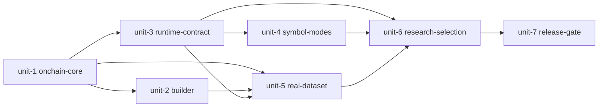

# Plan: santiment-onchain-integration — 2026-09-10
> Generated by writing-plans against commit 39c66ff (39c66ff3fbd6ac930962f24183cdf27cecfbbf0d) on branch main at 2026-09-10T12:00:00Z
> Drift check: executor must run `git rev-parse HEAD` and compare; if > 50 commits or base_branch changed, STOP and ask for re-plan/reconcile.
> Verification baseline (detected from repo):
> - build: none detected (Python package, no build step; use `.venv/bin/python -m compileall` as smoke)
> - test: `PYTEST_LOW_MEMORY=1 .venv/bin/python -m pytest tests/unit/<file> -q` (sharded; never run full `tests/unit tests/property` together locally without low-memory flag; OOM risk)
> - lint: `git diff --check` (whitespace) + `PYTEST_LOW_MEMORY=1` sharded suites
> - typecheck: none detected
> Planning mode: deep (plan-advisor call ses_f74d11d3affeoEbi308yxsDQlN, verdict REVISE, 7 units adopted)
> Source specs: `plan/2026-09-09-santiment-onchain-integration.md` (13 tasks) + `plan/2026-09-09-santiment-onchain-integration-design.md`

## Goal
Add twelve causal bounded Santiment features to eighteen supplied rule features, make production Phase 2 use exactly thirty supplied features, and validate by pre-registered purged multi-seed tests without tuning on test or forward data.

## Non-goals
- No profit claim or guarantee; only causal reproducible selection.
- No change to OHLCV, labels, evaluator math, fee model, or HWC/MWC computation except RSI alias removal and lineage digests.
- No tuning of features, windows, lags, or winners on `test_new.csv` or forward tape.
- No commit of 66 MB extracted Santiment sources or staged temp CSVs; only hashes, manifest, and final tapes.
- No blind search-budget increase; families screened first.

## Context & Evidence
- Decisions: brainstorming 2026-09-10 — registry-driven past-only builder, metric-specific aggregation/release, per-symbol prior-only scaling to [-1,1], backward as-of join, atomic replace, explicit `supplied_ff` vs `generated_lwc` catalog, explicit `global` vs `specialist` symbol mode, named RB profiles, registered ablations, one-shot forward acceptance.
- Key files touched (all read this session):
  - `gpu_fuzzy_trader/config.py:237-256` – current 18-tuple `RULE_ALLOWED_FF_FEATURES`; `:2694-2700` validates ==18; must become 30 + source/symbol/RB controls.
  - `gpu_fuzzy_trader/features/catalog.py:26-48` – `candidate_rule_feature_columns` filters `ff_*` by allowlist; `:69-80` `build_rule_feature_specs`; needs explicit `supplied_ff` policy.
  - `gpu_fuzzy_trader/run_pipeline.py:212-276` – `_merge_mtf_lwc_runtime_columns` discards all `ff_*` from base, keeps only `lwc_*`+scores; must retain allowlisted `ff_*`.
  - `gpu_fuzzy_trader/data/multi_timeframe.py:251-254` – assigns both `rsi_14` and `rsi_14_midline` to same value; collapse to one.
  - `gpu_fuzzy_trader/features/fuzzy_scaling.py:106-130` – `validate_rule_feature_ranges`; `:133-190` train-fitted ordinal scaling; needs `bounded_continuous` contract for `ff_oc_*`.
  - `gpu_fuzzy_trader/research_integrity.py:1-80` – dataset manifests, lineage; must add feature-contract digest.
  - `gpu_fuzzy_trader/rb_governor.py:2009-2018` – allowlist-aware mode recovery; silent canonical override to be removed, replaced by explicit `RB_PROFILE` resolver.
  - `data/train_new.csv:1`, `data/test_new.csv:1` – 7 base + 18 `ff_*` today; target 7+30=37 cols, 140352 train / 39152 test rows.
  - `.gitignore:230-234` – ignores `/outputs/*`; needs Santiment source + staged CSV ignores.
  - `tests/unit/test_config_additions.py:16-17` – asserts 18; must become 30.
- Impact insight (from `nexus impact --json` when available):
  - To be run fresh before every implementer dispatch per V5 invariant. Expected blast: config → catalog, run_pipeline, rb_governor, research_integrity, optuna_search, phase2 pool, fuzzy_scaling, MTF, all feature/catalog/MTF/run/RB tests.
- Existing patterns to match:
  - Exemplar: `gpu_fuzzy_trader/features/catalog.py` – deterministic train-only, allowlist filter, no validation/test fit.
  - Exemplar: `gpu_fuzzy_trader/features/fuzzy_scaling.py` – fail-closed range check, train-only manifest, pure apply.
  - Exemplar: `gpu_fuzzy_trader/data/multi_timeframe.py:27-35` – UTC handling, naive storage with UTC semantics.

## Findings triage
| # | Finding | Category | Impact | Effort | Confidence | Evidence |
|---|---------|----------|--------|--------|------------|----------|
| 1 | MTF merge discards supplied `ff_*`, contradicts config allowlist | correctness | HIGH | S | HIGH | `run_pipeline.py:234-246` |
| 2 | Duplicate `rsi_14` / `rsi_14_midline` same value | correctness | MEDIUM | XS | HIGH | `multi_timeframe.py:251-254` |
| 3 | No `RULE_FEATURE_SOURCE_MODE`, `PHASE2_SYMBOL_MODE`, `RB_PROFILE` controls | contract | HIGH | S | HIGH | `grep` zero hits in code |
| 4 | Ordinal-only scaling manifest ignores pre-bounded floats | contract | HIGH | S | HIGH | `fuzzy_scaling.py:143-166` |
| 5 | Cache/archive identity ignores feature contract | leakage/safety | HIGH | M | HIGH | `research_integrity.py:70-80` |
| 6 | Silent RB canonical override mutates global defaults | correctness | MEDIUM | S | MEDIUM | plan Task 9 + `rb_governor.py` review |

Rejected / by-design:
- None yet; Task 12 revert-to-18 resolved below (keep 30-code, freeze symbol/RB only; feature-count revert needs separate evidence commit, never silent).

## Contract-conflict resolution (advisor missing dependency #1)
Production code implements exactly 30 supplied features (`18 legacy + 12 ff_oc_*`). Task 12 selection freezes only `PHASE2_SYMBOL_MODE` and `RB_PROFILE` plus Phase 2 hyperparams. If hybrid-30 does not beat supplied-18 baseline, orchestrator keeps 30-code as experimental dataset path and reverts production default to 18 in a separate explicit commit; never force 12 features for cosmetic count.

## Execution Unit Justification
Number of units: 7

Why not fewer:
- Data causality (registry/audit/gap/aggregation/transforms), atomic join/manifest, runtime catalog/lineage, symbol routing/provenance, large data artifact, research selection, and final regression/docs each have distinct failure modes, reviewers, and STOP gates. Merging e.g. causal math with catalog retention would hide leakage vs retention regressions and exceed reviewer-audit size.
- Large CSV commit must stay separate for revertability. Research selection must run only after deterministic contracts pass, else test-misuse risk.

Why not more:
- Tasks 1-4 share one `onchain_pipeline` semantic boundary and one test module; splitting registry vs aggregation vs scaling would create churn on same files with no independent deployability.
- Tasks 6-7 share one runtime boundary (catalog+MTF+scaling+lineage). Tasks 9+12 share one research outcome (RB profile + ablation + freeze). Tasks 11+13 share one release gate. Further splits would be implementation steps, not reviewable units.

## Plan Check Dispositions
- code: DUPLICATE_ALLOWED_FILE
  units: unit-1, unit-2
  file: gpu_fuzzy_trader/data/onchain_pipeline.py
  decision: KEEP_SEPARATE
  reason: Sequential extension of same new module. Unit-1 creates pure causal math. Unit-2 appends join, manifest, and verify helpers. No parallel edit. Second unit reuses tested helpers.
- code: DUPLICATE_ALLOWED_FILE
  units: unit-3, unit-4, unit-6
  file: gpu_fuzzy_trader/config.py
  decision: KEEP_SEPARATE
  reason: Sequential config layers. Unit-3 adds 30-feature catalog and source mode. Unit-4 adds symbol mode. Unit-6 adds RB profile. Each validates alone. No parallel edit.
- code: DUPLICATE_ALLOWED_FILE
  units: unit-3, unit-4
  file: gpu_fuzzy_trader/run_pipeline.py
  decision: KEEP_SEPARATE
  reason: Sequential functions. Unit-3 changes merge retention. Unit-4 extracts global versus specialist routing. Distinct functions. Review global freeze before specialist.
- code: MERGE_CANDIDATE
  units: unit-1, unit-2
  decision: KEEP_SEPARATE
  reason: Unit-1 is pure causal math with synthetic fixtures. Unit-2 is IO, atomic replace, and manifest. Separate leakage versus durability review.
- code: MERGE_CANDIDATE
  units: unit-3, unit-4
  decision: KEEP_SEPARATE
  reason: Unit-3 freezes shared catalog and lineage for all modes. Unit-4 adds specialist routing. Merging risks silent global change. Verify global freeze first.
- code: MERGE_CANDIDATE
  units: unit-3, unit-6
  decision: KEEP_SEPARATE
  reason: Unit-3 is deterministic runtime contract. Unit-6 is research selection using that contract. Contract must pass before any selection runs.
- code: MERGE_CANDIDATE
  units: unit-4, unit-6
  decision: KEEP_SEPARATE
  reason: Unit-4 freezes routing and provenance. Unit-6 runs ablations across both modes. Routing must be fixed before comparison.

## Execution Unit breakdown (ordered, dependencies noted)
### Execution Unit 1: Causal on-chain core (slug: onchain-core)
- id: unit-1
- Effort: L
- Confidence: HIGH
- Risk if wrong: HIGH — future leakage or wrong aggregation invalidates all downstream tapes.
- Depends on: none
- Evidence:
  - `gpu_fuzzy_trader/config.py:237-256` – 18 allowlist to extend later (not in this unit)
  - `gpu_fuzzy_trader/data/multi_timeframe.py:27-35` – UTC convention to follow
  - `gpu_fuzzy_trader/features/fuzzy_scaling.py:106-130` – fail-closed range pattern
- Scope:
  - In: `gpu_fuzzy_trader/data/onchain_registry.py`, `gpu_fuzzy_trader/data/onchain_pipeline.py` (registry, audit, `repair_funding_grid`, `aggregate_metric`, `transform_metric`, `build_symbol_feature_frame`), `tests/unit/test_onchain_registry.py`, `tests/unit/test_onchain_pipeline.py`
  - Out (do NOT touch): `config.py`, `catalog.py`, `run_pipeline.py`, `multi_timeframe.py` runtime, `scripts/build_onchain_dataset.py`, real `data/*.csv`, RB/ablation.
  - Related callers (blast): none yet (new module); future consumers unit-2/3.
- Acceptance criteria:
  - [ ] Registry has exactly 12 unique `ff_oc_*` with specified aggregation/raw/scale/release/window/min_periods; Funding only `allow_funding_gap=True`; version `1.0.0`.
  - [ ] Audit rejects duplicate dates, non-finite, missing metrics, unsupported assets, non-Funding gaps with tokens `duplicate`, `non-finite`, `missing source metrics`, `unsupported asset`, `unexpected timestamp gap`.
  - [ ] Funding 25-row past-only carry passes; >8h fails; no `bfill`/`interpolate`/`fillna(0)` in module.
  - [ ] Hourly closed-bucket sum/last/mean + `available_at` (bucket end+delay; social 45m; daily D+1 02:00 UTC) pass; future-suffix invariance holds.
  - [ ] Centered/zero scales are prior-only, per-symbol, bounded [-1,1], warm-up NaN, constant series yields no extremes, suffix-invariant.
- Verification gates:
  1. `PYTEST_LOW_MEMORY=1 .venv/bin/python -m pytest tests/unit/test_onchain_registry.py tests/unit/test_onchain_pipeline.py -q` – expected: all pass.
  2. `PYTEST_LOW_MEMORY=1 .venv/bin/python -m pytest tests/unit/test_onchain_registry.py -q` – expected: pass after registry impl.
  3. `git diff main...feature/unit-1-onchain-core --stat` – only the 3 in-scope files.
- STOP conditions:
  - STOP if any non-Funding gap, Funding >8h, suffix mutation changes earlier value, daily visible before D+1 02:00, or finite outside [-1,1].
  - STOP if base `pytest` on main already fails for these files (run baseline first).
  - STOP if another branch already created `onchain_registry.py` (check `git log main..HEAD -- gpu_fuzzy_trader/data/onchain_registry.py`).
- Implementation sketch:
  - Step 1: registry dataclass + 12 specs + lookup + inventory tests.
  - Step 2: strict CSV discovery by 2nd column, asset map Bitcoin/Ethereum, UTC parse, uniqueness/monotonicity, complete (symbol,metric) grid.
  - Step 3: capped ffill Funding repair with audit dict.
  - Step 4: left-closed left-labeled 1h resample requiring 4 obs (Funding already gridded), `available_at`=end+delay, daily D+1 02:00.
  - Step 5: raw fns `signed_log1p`, `log_change`, `log1p`, `pct_change_7d`; rolling prior-only centered (`tanh(clip(z,-5,5)/2.5)`, IQR/1.349) and zero-anchored (1.4826*median|hist|), zero-scale→NaN.

### Execution Unit 2: Atomic enrichment builder (slug: onchain-builder)
- id: unit-2
- Effort: M
- Confidence: HIGH
- Risk if wrong: HIGH — partial replace corrupts canonical tapes.
- Depends on: unit-1
- Evidence:
  - `gpu_fuzzy_trader/research_integrity.py:27-33` – `sha256_file` pattern to reuse.
  - `gpu_fuzzy_trader/run_pipeline.py:254-256` – duplicate-key fail-closed pattern.
- Scope:
  - In: `gpu_fuzzy_trader/data/onchain_pipeline.py` (enrich, manifest, verify), `scripts/build_onchain_dataset.py`, `tests/unit/test_onchain_dataset_builder.py`, `.gitignore`
  - Out: config, catalog, MTF, RB, real tape replace (unit-5).
- Acceptance criteria:
  - [ ] Backward as-of per symbol (`available_at <= datetime`), not visible before `available_at`; preserves row count/order/keys/OHLCV/18 `ff_*`, adds exactly 12 cols; duplicate keys fail.
  - [ ] Deterministic manifest with registry_version, source/target/output hashes, feature_names, coverage, funding_gap, build_params; `created_at` outside hashed `contract`; digest excludes wall-clock.
  - [ ] Staged `*.staged.csv` + re-read verify + manifest write, `os.replace` only with `--replace`; failed verify leaves originals byte-identical.
  - [ ] `git status --short` never lists extracted sources or staged files.
- Verification gates:
  1. `PYTEST_LOW_MEMORY=1 .venv/bin/python -m pytest tests/unit/test_onchain_dataset_builder.py tests/unit/test_onchain_pipeline.py -q` – expected: pass.
  2. `git diff --check` – expected: clean.
  3. `git diff main...feature/unit-2-onchain-builder --stat` – only in-scope files.
- STOP conditions:
  - STOP if enrichment changes any original value, adds ≠12 cols, or forward-visible join.
  - STOP if atomicity test shows original modified on forced verify failure.
  - STOP if drift: unit-1 files changed unexpectedly.
- Implementation sketch:
  - Step 1: per-symbol sort + `merge_asof(direction=backward)` + order restore + original compare.
  - Step 2: manifest builder + deterministic JSON + digests.
  - Step 3: CLI staging, verify, conditional replace, `--verify-only` shape check.

### Execution Unit 3: Thirty-feature runtime contract + lineage (slug: runtime-contract)
- id: unit-3
- Effort: M
- Confidence: HIGH
- Risk if wrong: HIGH — wrong catalog or stale cache silently selects on wrong features.
- Depends on: unit-1, unit-2
- Evidence:
  - `gpu_fuzzy_trader/features/catalog.py:26-48,69-80` – allowlist + specs to extend.
  - `gpu_fuzzy_trader/run_pipeline.py:234-246` – base_columns to allowlist.
  - `gpu_fuzzy_trader/features/fuzzy_scaling.py:133-190` – manifest to add `bounded_continuous`.
  - `gpu_fuzzy_trader/data/multi_timeframe.py:251-254` – duplicate to collapse.
  - `gpu_fuzzy_trader/config.py:2693-2701` – 18-check to become 30-check.
- Scope:
  - In: `gpu_fuzzy_trader/config.py` (legacy allowlist, 30-feature allowlist, source mode), `gpu_fuzzy_trader/features/catalog.py`, `gpu_fuzzy_trader/features/fuzzy_scaling.py`, `gpu_fuzzy_trader/data/multi_timeframe.py` (drop duplicate RSI keep midline), `gpu_fuzzy_trader/run_pipeline.py` (retain allowlisted supplied features, enforce identity, record lineage), `gpu_fuzzy_trader/research_integrity.py` (feature contract digest), `tests/unit/test_onchain_feature_contract.py`, updates to feature catalog, fuzzy scaling, MTF integration, multi-timeframe, research integrity, run pipeline tests
  - Out: symbol-mode routing (unit-4), RB profiles and ablation (unit-6), real tapes (unit-5).
- Acceptance criteria:
  - [ ] `supplied_ff` catalog is exactly ordered 30, no `lwc_*`/`mtf_*`; `generated_lwc` keeps old safe path; missing supplied feature fails closed.
  - [ ] MTF merge retains `ff_donchian_width_20` + `ff_oc_funding_rate`, drops `ff_unapproved`/`hwc_*`/`mwc_*`/arbitrary `ff_*`.
  - [ ] Pre-bounded `ff_oc_*` with all finite in [-1,1] get `bounded_continuous/scale 1.0`, pass through unchanged; out-of-range fails before Phase 2.
  - [ ] `rsi_14` gone, `rsi_14_midline` kept; computation unchanged.
  - [ ] `feature_contract_digest` hashes ordered 30 + source mode + registry + transforms + manifest contract; mismatch rejects splits/pools/archives/RB.
- Verification gates:
  1. `PYTEST_LOW_MEMORY=1 .venv/bin/python -m pytest tests/unit/test_onchain_feature_contract.py tests/unit/test_feature_catalog.py tests/unit/test_fuzzy_scaling.py tests/unit/test_mtf_pipeline_integration.py -q` – expected: pass.
  2. `PYTEST_LOW_MEMORY=1 .venv/bin/python -m pytest tests/unit/test_multi_timeframe.py tests/unit/test_research_integrity.py tests/unit/test_run_pipeline.py -q` – expected: pass.
  3. `.venv/bin/python -c "from gpu_fuzzy_trader import config; config.validate_config(); print(len(config.RULE_ALLOWED_FF_FEATURES))"` – expected: `30`.
- STOP conditions:
  - STOP if catalog ≠30, any `lwc_/mtf_` leaks, or stale cache survives digest change.
  - STOP if `rsi_14` removal changes RSI values (not just alias).
  - STOP if scaling fits on validation/test or alters bounded values.
- Implementation sketch:
  - Step 1: config constants + validation.
  - Step 2: catalog branch by source mode.
  - Step 3: merge allowlist + scaling contract + RSI dedup + digest + lineage wiring.

### Execution Unit 4: Explicit Phase 2 symbol modes (slug: symbol-modes)
- id: unit-4
- Effort: M
- Confidence: MEDIUM (routing touches Phase 2 generator wiring; verify by reading `phases/phase2_rule_pool.py` at execution)
- Risk if wrong: MEDIUM — cross-symbol threshold mixing or lost provenance.
- Depends on: unit-3
- Evidence:
  - `gpu_fuzzy_trader/config.py:237-256` – config pattern for new `PHASE2_SYMBOL_MODE`.
  - `gpu_fuzzy_trader/run_pipeline.py:212-276` – merge isolation pattern to reuse for per-symbol slicing.
- Scope:
  - In: `gpu_fuzzy_trader/config.py` (symbol mode), `gpu_fuzzy_trader/run_pipeline.py` (global and specialist runners, routing), `gpu_fuzzy_trader/phases/phase2_rule_pool.py` (per-slice generator, provenance), `tests/unit/test_phase2_symbol_modes.py`
  - Out: RB values (unit-6), catalog (frozen), real data (unit-5).
- Acceptance criteria:
  - [ ] Invalid mode fails `validate_config` with `PHASE2_SYMBOL_MODE`.
  - [ ] Default `global` preserves current one-generator-per-direction behavior, identity, schema; logs/manifests show resolved mode.
  - [ ] Specialist runs each (symbol,direction) with independent slices + `island_hyperparams(n_rows)`, attaches immutable single-symbol provenance; multi-symbol rule fails closed; no cross-symbol migration in v1.
  - [ ] Provenance survives Phase 2 → RB without rewrite.
- Verification gates:
  1. `PYTEST_LOW_MEMORY=1 .venv/bin/python -m pytest tests/unit/test_phase2_symbol_modes.py tests/unit/test_rb_island_source_symbols.py tests/unit/test_run_pipeline.py -q` – expected: pass.
  2. `git diff main...feature/unit-4-symbol-modes --stat` – only in-scope files.
- STOP conditions:
  - STOP if global path changes outputs vs main (snapshot before).
  - STOP if specialist shares rows across symbols or provenance missing/rewritten.
  - STOP if empty folds/candidates crash instead of fail-closed.
- Implementation sketch:
  - Step 1: config + validation + logging.
  - Step 2: extract global path unchanged.
  - Step 3: specialist loop with slicing + provenance + RB handoff.

### Execution Unit 5: Real dataset build + data contract proof (slug: real-dataset)
- id: unit-5
- Effort: M
- Confidence: MEDIUM (depends on external 24-file source snapshot being present and correct)
- Risk if wrong: HIGH — corrupts canonical tapes; must stay revertible.
- Depends on: unit-1, unit-2, unit-3
- Evidence:
  - `data/train_new.csv:1`, `data/test_new.csv:1` – 18-col header to become 37.
  - `gpu_fuzzy_trader/research_integrity.py:27-33` – hash verification pattern.
- Scope:
  - In: `data/train_new.csv`, `data/test_new.csv`, `data/onchain_feature_manifest.json` (generated only). Source extraction uses ignored directory, not committed.
  - Out: all code (frozen); no runtime or research tuning in this unit.
- Acceptance criteria:
  - [ ] Sources extracted to ignored dir; `git status --short` clean of sources/staged files.
  - [ ] Staged build manifest shows 24 files, 12 new / 30 total, BTC/ETH Funding 25 each, 0 unexpected gaps/duplicates/changed values/range violations.
  - [ ] Suffix-mutation replay after `2026-07-23 21:45` on copied sources leaves train+test hashes unchanged.
  - [ ] `--replace` only after staged pass; `--verify-only` confirms 140352 train / 39152 test rows, 37 cols (7 base+30).
  - [ ] Separate commit `data: add causal Santiment features`.
- Verification gates:
  1. Staged build + manifest inspect – expected: counts above.
  2. Suffix replay – expected: hashes unchanged.
  3. `--verify-only` – expected: row/col counts.
  4. `git diff --cached --stat` – only 3 data files.
- STOP conditions:
  - STOP if any non-Funding gap, Funding ≠25/asset, changed originals, range violation, or suffix dependence.
  - STOP if source snapshot missing, has ≠24 files, or hashes undocumented.
  - STOP if row counts differ from 140352/39152 or cols ≠37.
- Implementation sketch:
  - Step 1: `mkdir -p data/onchain/source-v1 && unzip` + gitignore check.
  - Step 2: staged build without `--replace` + manifest review.
  - Step 3: suffix replay on temp copy.
  - Step 4: `--replace` + `--verify-only` + isolated data commit.

### Execution Unit 6: RB profiles + registered ablations + frozen selection (slug: research-selection)
- id: unit-6
- Effort: L
- Confidence: MEDIUM (touches RB governor + Optuna + ledger; long-running)
- Risk if wrong: HIGH — test-tuning or silent default change invalidates research.
- Depends on: unit-3, unit-4, unit-5
- Evidence:
  - `gpu_fuzzy_trader/rb_governor.py:2009-2018` – allowlist-aware logic hosting silent override to remove.
  - `gpu_fuzzy_trader/research_integrity.py:70-80` – ledger/manifest pattern for experiment records.
- Scope:
  - In: `gpu_fuzzy_trader/config.py` (RB profile), `gpu_fuzzy_trader/rb_governor.py` (explicit resolver, remove silent override), `gpu_fuzzy_trader/optuna_search.py`, `scripts/run_onchain_ablation.py`, `tests/unit/test_onchain_ablation.py`, `profiles/onchain_v1.json` (frozen winner only after evidence)
  - Out: production default flip (only if winner passes, explicit commit), test and forward tuning, docs (unit-7).
- Acceptance criteria:
  - [ ] Six 2-feature families + variants (generated_lwc, supplied_18, onchain_12, hybrid_30, 6×LOFO, global/specialist hybrids, historical/diverse finalists) registered; `selection_splits` never contain `test`/`forward`.
  - [ ] Screening seeds (11,42,73,101,137), finalist seeds (11,23,42,73,101,137,173,211,251,307); budgets identical across variants.
  - [ ] `advances` requires ≥4/5 positive deltas + median>0 + worst-seed non-degradation + cost-stress + coverage; `candidate_score` never uses test.
  - [ ] Runner rejects `test_new.csv` as selection input with `selection data`; all runs append variant/seed/hashes/contract/mode/profile/budget/metrics to ledger.
  - [ ] `profiles/onchain_v1.json` frozen before validation-selection consume, hashed + ledger-appended; single one-shot selection eval; no retry/threshold/family/hparam change after; winner sets defaults only on pass, else retain 18-baseline production + experimental builder.
- Verification gates:
  1. `PYTEST_LOW_MEMORY=1 .venv/bin/python -m pytest tests/unit/test_onchain_ablation.py tests/unit/test_rb_correlation.py tests/unit/test_marginal.py tests/unit/test_optuna_search.py -q` – expected: pass.
  2. Screening 5-seed run to `outputs/onchain_screening_v1` – expected: report with paired deltas.
  3. Finalist 10-seed run to `outputs/onchain_finalists_v1` – expected: frozen profile + ledger entry.
- STOP conditions:
  - STOP if any variant reads test/forward for selection or ledger misses required fields.
  - STOP if budgets differ across variants or seeds changed mid-stage.
  - STOP if winner selected without 4/5 + median + worst-seed + stress + coverage pass.
  - STOP if validation-selection consumed more than once or tuned after failure (start new generation instead).
- Implementation sketch:
  - Step 1: families + variant registry + split-role guard (not filename substring).
  - Step 2: RB profile resolver + override removal.
  - Step 3: fixed seeds + paired gate + ledger writer + CLI stages.
  - Step 4: screening → gate → finalists → freeze → one-shot selection → conditional default update.

### Execution Unit 7: Regression, parity, smoke + truthful docs (slug: release-gate)
- id: unit-7
- Effort: M
- Confidence: HIGH
- Risk if wrong: MEDIUM — stale docs or untested parity hide regressions.
- Depends on: unit-6
- Evidence:
  - `README.md:139`, `RUN.md:119` – supplied-feature contract lines to correct.
  - `gpu_fuzzy_trader/config.py:237-256` – final 30 to document.
- Scope:
  - In: `README.md`, `RUN.md`. Defect fixes only if sharded tests fail, minimal diffs. Smoke evidence stays ignored, not committed.
  - Out: no feature, catalog, or RB logic changes except verified defect fixes; no retuning; benchmark and CUDA full runs stay on GPU host, not local.
- Acceptance criteria:
  - [ ] Sharded low-memory suites pass: data/feature/split/MTF; CPU/GPU parity + encoder properties (with 12-feature fixture if needed); integrity/ledger/multiplicity/RB/symbol/ablation.
  - [ ] One-symbol small-budget smoke (`DEBUG_SYMBOL_SCOPE`, 32 pop/2 gens) shows `rule_features=30`, no range violation, no stale reuse, no pre-Phase-5 `test_new.csv` read; CUDA smoke on GPU host records hw/JAX/mem/time.
  - [ ] README states 30 vs HWC/MWC context, both source modes, release timing, Funding carry, global/specialist truth (no unconditional specialist claim unless selected), test-as-diagnostic, forward-only acceptance.
  - [ ] RUN lists exact build/verify/screening/finalist/debug/GPU/diagnostic/forward commands with protected-split annotations.
  - [ ] `run_pipeline --help`, `validate_config` prints 30, `git diff --check` clean, broad `tests/unit tests/property` low-memory pass (sharded), no sources/staged/caches committed, manifests match tapes+profile.
- Verification gates:
  1. `PYTEST_LOW_MEMORY=1 .venv/bin/python -m pytest tests/unit/test_onchain_registry.py tests/unit/test_onchain_pipeline.py tests/unit/test_onchain_dataset_builder.py tests/unit/test_onchain_feature_contract.py tests/unit/test_data_loader.py tests/unit/test_data_splitter.py tests/unit/test_feature_catalog.py tests/unit/test_fuzzy_scaling.py tests/unit/test_multi_timeframe.py tests/unit/test_mtf_pipeline_integration.py -q` – sharded, expected: pass.
  2. `PYTEST_LOW_MEMORY=1 .venv/bin/python -m pytest tests/unit/test_cpu_engine.py tests/unit/test_gpu_engine.py tests/unit/test_phase2_batch_evaluator_parity.py tests/property/test_encoder_properties.py -q` – expected: pass.
  3. `PYTEST_LOW_MEMORY=1 .venv/bin/python -m pytest tests/unit/test_research_integrity.py tests/unit/test_experiment_ledger.py tests/unit/test_multiplicity.py tests/unit/test_rb_correlation.py tests/unit/test_marginal.py tests/unit/test_phase2_symbol_modes.py tests/unit/test_onchain_ablation.py -q` – expected: pass.
  4. Docs + `git diff --check` + `validate_config==30` – expected: clean/30.
- STOP conditions:
  - STOP if any sharded suite fails on main baseline too (record baseline first; fix separately).
  - STOP if smoke shows leakage, range violation, or test read before Phase 5.
  - STOP if docs claim specialist/diverse as production without frozen-profile evidence.
- Implementation sketch:
  - Step 1: sharded regression + parity (never one giant pytest locally).
  - Step 2: CPU smoke + GPU-host smoke with ledger record.
  - Step 3: README/RUN truthful update + final `git diff --check` + manifest/hash audit + docs commit.

## Execution order & dependency graph
- Recommended order: unit-1 → unit-2, unit-3 → unit-4 → unit-5 → unit-6 → unit-7 (unit-2 and unit-3 both need unit-1; unit-5 needs 1+2+3; unit-6 needs 3+4+5)
- Parallelizable: unit-2 and unit-3 can start in parallel after unit-1 merges (isolated branches), but unit-5 must wait for both.
- Mermaid:

## Verification strategy (global)
- Baseline: on main, run each sharded gate once, record pass/fail in handoff; never blame a unit for pre-existing failure.
- Per-unit: run unit-specific gates + `git diff --check` + `git diff main...feature/<slug> --stat` scope check; use `.venv/bin/python` and `PYTEST_LOW_MEMORY=1`; shard broad suites; GPU/bench only on GPU host.
- Final: sharded `tests/unit tests/property` low-memory + smoke + `--verify-only` + manifest/hash audit + 30-count check.
- Leakage proof at every data step: suffix-mutation replay, release-boundary checks, Funding 25/25, 0 unexpected gaps, finite in [-1,1].

## Rollback / safety
- Each unit is an isolated feature branch/worktree; discard if BLOCKED.
- Data commit (unit-5) isolated and revertible; never mix with code.
- No `os.replace` without staged verify; two-tape replace must leave both originals intact on mid-failure (verify unit-2 test).
- No forced push to main, no migration, no forward-tape consume except one-shot acceptance.

## Outcome memory
- After each unit, orchestrator records outcomes in `.opencode/memory/` + handoff JSON (seeds, hashes, digests, winner, failures).
- Check `.opencode/reflections/LESSONS.md` before each unit; avoid repeating leakage/cache/scale mistakes.
- Forward acceptance requires strictly newer one-shot tape; `test_new.csv` stays consumed diagnostic.

## Expert workflow notes (all aspects)
- Causality: transforms use `shift(1)` + rolling; aggregation uses closed buckets + `available_at`; join uses backward as-of; daily D+1 02:00; Funding ffill limit 32 on strict 15m grid with leading/trailing fail-closed.
- Reasonable workflow: freeze registry → prove causality on synthetics → prove atomicity → wire runtime → make modes explicit → build real tapes once → select with registered multi-seed gates → document truthfully. Never select before contracts pass; never tune on test.
- Scale: hourly window 2160/min 720 (90d/30d), daily 180/30; `tanh(clip(z,-5,5)/2.5)`; zero-scale→NaN (no epsilon extremes); warm-up NaN preserved (`FILL_NA_WITH_ZERO=False`).
- Cache: hash ordered names + mode + registry + transforms + manifest contract + data hashes; reject stale splits/pools/archives/RB.
- OOM: shard tests, `PYTEST_LOW_MEMORY=1`, `.venv` only, GPU separately.
